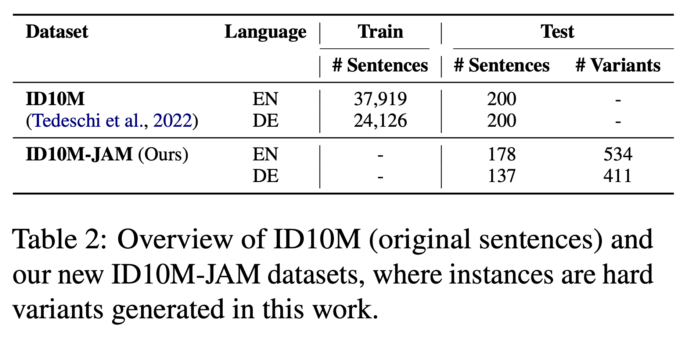
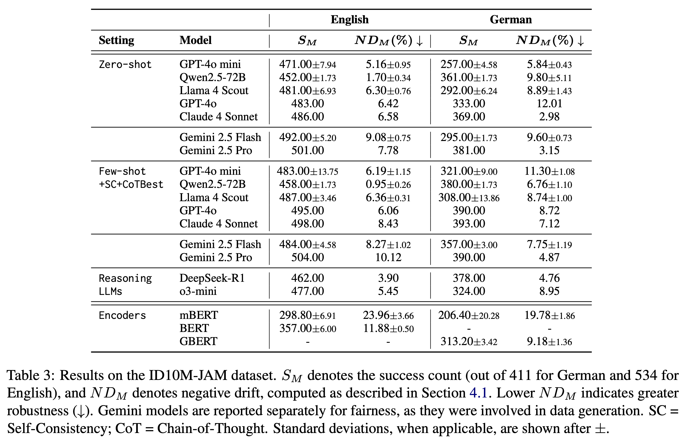

# ID10M-JAM: Stress-Testing Idiom Identification Under Challenging Context

**ACL 2026** · [[Paper]]() · [[Dataset (HuggingFace)](https://huggingface.co/datasets/Intellexus/ID10M-JAM)]

ID10M-JAM evaluates idiom identification under challenging confusing-context conditions. We benchmark 10 LLMs across English and German on two tasks: **id10m** — a standard idiom identification task — and **id10m-jam** — our new benchmark where each idiom-containing sentence is paired with LLM-generated confusing-context variants designed to mislead models into literal interpretations.

---

## 📁 Dataset

| Dataset | Description | Languages | Availability |
|---|---|---|---|
| `id10m-jam` | Idiom identification with confusing-context variants (ours) | English, German | [HuggingFace](https://huggingface.co/datasets/Intellexus/ID10M-JAM) |
| `id10m` | Standard idiom identification baseline (filtered & corrected for this paper) | English, German | `data_generation/id10m_fixed/` |

The original ID10M dataset is available on [GitHub](https://github.com/Babelscape/ID10M).

<div align="center">
  
</div>

No manual download needed — experiment scripts load `id10m-jam` automatically from HuggingFace, and `id10m` is committed at `data_generation/id10m_fixed/`. To download `id10m-jam` locally:

```bash
python data_generation/download_id10m_jam.py
```

---

## 📋 Repository Overview

| Path | Purpose |
|---|---|
| `experiments/src/` | Task utilities for `id10m_jam` and `id10m` (data loading, prompts, metrics) |
| `utils/` | Shared utilities: metrics, LLM wrappers, schemas |
| `data_generation/generation/` | Gemini-based pipeline that generated the confusing-context variants |
| `data_generation/id10m_fixed/` | id10m dataset (English + German, JSON + CSV) |
| `data_generation/download_id10m_jam.py` | Download id10m-jam from HuggingFace |
| `analysis/` | Scripts to reproduce all plots and comparison tables from the paper |
| `encoders/` | Encoder experiments |
| `assets/` | Paper figures |

---

## 🚀 Quick Start

**Prerequisites:** Python 3.10+

```bash
pip install -r requirements.txt
```

Copy and fill in your API keys:

```bash
cp keys.yaml.example keys.yaml
# Edit keys.yaml with your OPENAI_API_KEY, GOOGLE_API_KEY, ANTHROPIC_API_KEY, TOGETHER_API_KEY
```

Run a zero-shot evaluation (GPT-4o-mini, id10m-jam, English):

```bash
python run_id10m_jam.py
```

---

## 🔧 Data Generation

The `data_generation/generation/` folder contains the pipeline used to create the id10m-jam confusing-context variants using Gemini. Requires a Gemini API key in `.env`:

```bash
cd data_generation/generation
python variants_generator.py
```

---

## 🏃‍♂️ Running Experiments

### LLM Evaluation

Edit `config.yaml` to configure your task, model, and prompt type, then run:

```bash
# id10m task
python run_id10m.py

# id10m-jam task (supports self-consistency)
python run_id10m_jam.py

# Override config values via CLI
python run_id10m_jam.py --seed 43 --lang german --sc_runs 5
python run_id10m_jam.py --config_file my_config.yaml

# Re-evaluate existing responses without calling the API
python run_id10m_jam.py --responses_dir results/id10m_jam/english/<model>/<prompt_type>/seed_42
```

### Key Config Parameters (`config.yaml`)

| Parameter | Options | Description |
|---|---|---|
| `task` | `id10m_jam`, `id10m` | Task to run |
| `lang` | `english`, `german` | Language |
| `model` | see table below | LLM to evaluate |
| `prompt_type` | `zero_shot`, `few_shot_cot_best` | Prompting strategy |
| `shots` | `0`, `10` | Few-shot examples (must be even; 0 for zero-shot) |
| `sc_runs` | `1`, `5` | Self-consistency runs (1 = disabled) |
| `temperature` | `0.3`, `0.8` | Use 0.3 without SC, 0.8 with SC |
| `debug` | `true`, `false` | Run on 5 samples, skip W&B logging |

### Supported Models

| Provider | Model string |
|---|---|
| OpenAI | `gpt-4o`, `gpt-4o-mini`, `o3-mini` |
| Google | `gemini-2.5-pro`, `gemini-2.5-flash-lite` |
| Anthropic | `claude-sonnet-4-20250514`, `claude-3-haiku-20240307` |
| Together.ai | `meta-llama/Llama-4-Scout-17B-16E-Instruct`, `deepseek-ai/DeepSeek-R1`, `Qwen/Qwen2.5-72B-Instruct-Turbo` |

### Experiment Outputs

Each run writes to `results/{task}/{lang}/{model}/{prompt_type}/seed_{N}/`:

```
results/id10m_jam/english/<model>/<prompt_type>/seed_42/
    config.yaml               # experiment config snapshot
    responses.json            # raw LLM responses
    metrics.json              # precision / recall / F1
    results.tsv               # per-sample predictions
    conf_matrices_reports.txt
```

Aggregate results per task are written to `results/{task}/{lang}/full_results.csv`.

---

## 📊 Reproducing Paper Results

### Step 1 — Run experiments

```bash
# id10m baseline
python run_id10m.py

# id10m-jam benchmark
python run_id10m_jam.py
```

### Step 2 — Compute comparisons (id10m vs. id10m-jam)

```bash
python analysis/compare_id10m_vs_id10m_jam.py
# Outputs: results/comparisons/{lang}/model_comparison_table.csv
#          results/comparisons/{lang}/{model}/{prompt}/seed_{N}/metrics.json
```

### Step 3 — Generate analysis tables and plots

```bash
# Per-run comparison table
python analysis/generate_comparison_table.py

# Main LLM comparison table (id10m vs. id10m-jam)
python analysis/compare_id10m_vs_id10m_jam.py

# Confusion histograms (zero-shot and few-shot)
python analysis/plot_confusion_histogram.py

# Sentence-level confusion analysis
python analysis/sentence_confusion_analysis.py
```

---

## 🔬 Encoder Experiments

For running the encoder experiments, see the [`encoders/`](encoders/) folder — it contains a dedicated `README.md` with full instructions.

---

## 📈 Results

<div align="center">
  
</div>

> Full results and analysis are reported in the paper.

---

## 📜 Citation

If you use ID10M-JAM in your research, please cite:

**BibTeX:**

<!-- TODO: add -->

**APA:**

<!-- TODO: add -->

---

## 📄 License

Code: Apache 2.0. See [LICENSE](LICENSE).
Data: [CC BY-NC-SA 4.0](https://creativecommons.org/licenses/by-nc-sa/4.0/)

---

## Dataset Card Authors

Kai Golan Hashiloni et al. ([Intellexus Project](https://intellexus.net/))

## 📫 Dataset Card Contact

For questions or contributions: [kai.golanhashiloni@post.runi.ac.il](mailto:kai.golanhashiloni@post.runi.ac.il?subject=ID10M-JAM)

---

<div align="center">
  
  
  
</div>
