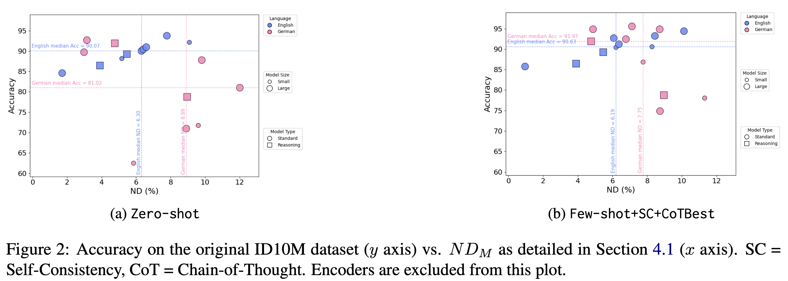
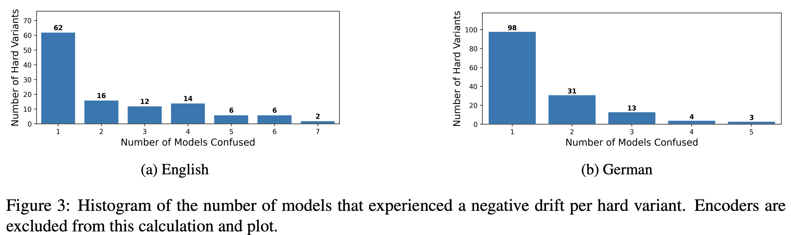

# Results

Experiment outputs are written here when you run the evaluation scripts. For the full
results, analysis, and discussion see the paper:

> **ID10M-JAM: Stress-Testing Idiom Identification Under Challenging Context**
> Kai Golan Hashiloni, Lior Livyatan, Ofri Hefetz, Alon Mannor, Bar Cohen, Kfir Bar
> ACL 2026

---

## Metrics

- **S_M** — success count: the number of hard variants whose *original* sentence was
  correctly classified by model M. Out of 534 (English) and 411 (German).
- **ND_M (%)** — negative drift: the proportion of those correctly-classified originals
  that flipped to an incorrect prediction on the hard variant. Lower is better (↓).

ND_M measures adversarial robustness independently of overall accuracy — a model can
have high accuracy yet high ND_M, or moderate accuracy with low ND_M.

---

## Main Results (Table 3)

| Setting | Model | EN S_M | EN ND_M (%) ↓ | DE S_M | DE ND_M (%) ↓ |
|---|---|---|---|---|---|
| Zero-shot | GPT-4o mini | 471 ± 7.9 | 5.16 ± 0.95 | 257 ± 4.6 | 5.84 ± 0.43 |
| | Qwen2.5-72B | 452 ± 1.7 | 1.70 ± 0.34 | 361 ± 1.7 | 9.80 ± 5.11 |
| | Llama 4 Scout | 481 ± 6.9 | 6.30 ± 0.76 | 292 ± 6.2 | 8.89 ± 1.43 |
| | GPT-4o | 483 | 6.42 | 333 | 12.01 |
| | Claude 4 Sonnet | 486 | 6.58 | 369 | 2.98 |
| | Gemini 2.5 Flash | 492 ± 5.2 | 9.08 ± 0.75 | 295 ± 1.7 | 9.60 ± 0.73 |
| | Gemini 2.5 Pro | 501 | 7.78 | 381 | 3.15 |
| Few-shot +SC+CoTBest | GPT-4o mini | 483 ± 13.8 | 6.19 ± 1.15 | 321 ± 9.0 | 11.30 ± 1.08 |
| | Qwen2.5-72B | 458 ± 1.7 | 0.95 ± 0.26 | 380 ± 1.7 | 6.76 ± 1.10 |
| | Llama 4 Scout | 487 ± 3.5 | 6.36 ± 0.31 | 308 ± 13.9 | 8.74 ± 1.00 |
| | GPT-4o | 495 | 6.06 | 390 | 8.72 |
| | Claude 4 Sonnet | 498 | 8.43 | 393 | 7.12 |
| | Gemini 2.5 Flash | 484 ± 4.6 | 8.27 ± 1.02 | 357 ± 3.0 | 7.75 ± 1.19 |
| | Gemini 2.5 Pro | 504 | 10.12 | 390 | 4.87 |
| Reasoning | DeepSeek-R1 | 462 | 3.90 | 378 | 4.76 |
| | o3-mini | 477 | 5.45 | 324 | 8.95 |
| Encoders | mBERT | 298.8 ± 6.9 | 23.96 ± 3.66 | 206.4 ± 20.3 | 19.78 ± 1.86 |
| | BERT | 357 ± 6.0 | 11.88 ± 0.50 | — | — |
| | GBERT | — | — | 313.2 ± 3.4 | 9.18 ± 1.36 |

Gemini models are reported separately as they were involved in data generation.
SC = Self-Consistency; CoT = Chain-of-Thought. Standard deviations shown after ±.

---

## Accuracy vs. Negative Drift

Each point is a model. Shape encodes model type, color encodes language, size encodes
model scale. Models in the upper-left are preferable: high accuracy on original ID10M
*and* low susceptibility to adversarial context.

---

## Hard Variant Difficulty Distribution

For each hard variant, how many models experienced negative drift. Most variants
confuse only one or two models; a small subset confuses nearly all of them, showing
the dataset contains a range of difficulty levels rather than uniformly hard examples.

---

## Dataset Overview

---

For the full results including literal/idiomatic breakdown (S_L, S_I, ND_L, ND_I),
sentence-level confusion analysis (AC/NC/MX), and encoder details, see the paper.
